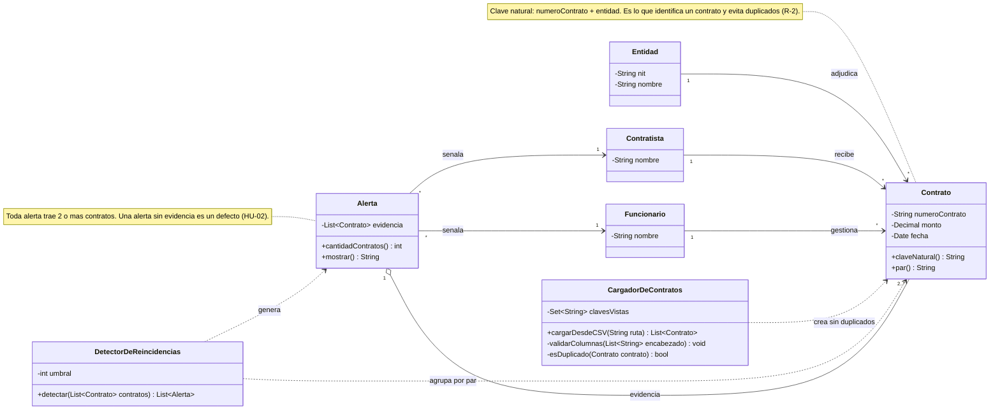

```mermaid
classDiagram
    direction LR

    class Entidad {
        -String nit
        -String nombre
    }

    class Contratista {
        -String nombre
    }

    class Funcionario {
        -String nombre
    }

    class Contrato {
        -String numeroContrato
        -Decimal monto
        -Date fecha
        +claveNatural() String
        +par() String
    }

    class CargadorDeContratos {
        -Set~String~ clavesVistas
        +cargarDesdeCSV(String ruta) List~Contrato~
        -validarColumnas(List~String~ encabezado) void
        -esDuplicado(Contrato contrato) bool
    }

    class DetectorDeReincidencias {
        -int umbral
        +detectar(List~Contrato~ contratos) List~Alerta~
    }

    class Alerta {
        -List~Contrato~ evidencia
        +cantidadContratos() int
        +mostrar() String
    }

    Entidad "1" --> "*" Contrato : adjudica
    Contratista "1" --> "*" Contrato : recibe
    Funcionario "1" --> "*" Contrato : gestiona

    CargadorDeContratos ..> Contrato : crea sin duplicados
    DetectorDeReincidencias ..> Contrato : agrupa por par
    DetectorDeReincidencias ..> Alerta : genera

    Alerta "1" o-- "2..*" Contrato : evidencia
    Alerta "*" --> "1" Contratista : senala
    Alerta "*" --> "1" Funcionario : senala

    note for Contrato "Clave natural: numeroContrato + entidad. Es lo que identifica un contrato y evita duplicados (R-2)."
    note for Alerta "Toda alerta trae 2 o mas contratos. Una alerta sin evidencia es un defecto (HU-02)."
```
