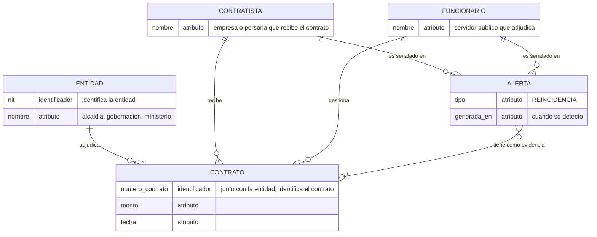
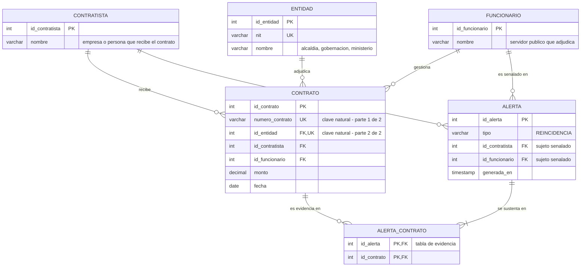

# Esquema de base de datos

Cómo se guardarían los datos de DAC. El diseño va en tres pasos y aquí
están los dos primeros:

| Paso | Qué responde | Estado |
|---|---|---|
| **1. Modelo conceptual (entidad–relación)** | Qué entidades existen y cómo se relacionan, sin pensar todavía en tablas | En este documento |
| **2. Modelo lógico (relacional)** | Cómo eso se convierte en tablas, claves y llaves foráneas | En este documento |
| 3. Modelo físico | Tipos exactos, longitudes, índices y motor | Pendiente |

> Todavía no hay base de datos: el MVP trabaja en memoria y no recuerda
> nada entre ejecuciones ([problema duro §5](problema-duro.md)). Este
> esquema es el diseño que resuelve [HU-07](historias-usuario.md).

## 1. Modelo conceptual (entidad–relación)

Cinco entidades y las relaciones entre ellas. **No hay llaves foráneas
ni tablas intermedias**: en este nivel las relaciones se dibujan, no se
guardan. Los atributos son solo los que existen en el mundo real.

Dos cosas que este diagrama debe dejar claras:

- **`CONTRATO` se identifica por `numero_contrato` + la entidad que lo
  adjudica.** Es una identificación **compuesta**, y es el
  [problema duro](problema-duro.md): `numero_contrato` solo no alcanza,
  porque dos entidades pueden usar el consecutivo `001`
  ([R-2](reglas-de-negocio.md)).
- **`ALERTA` – `CONTRATO` es N:M.** Una alerta se sustenta en varios
  contratos y un contrato puede sustentar varias alertas. La notación
  pata de gallo solo distingue "uno" de "varios"; en DAC el mínimo real
  es **2**, porque una alerta con un solo contrato no es una
  reincidencia ([HU-02](historias-usuario.md)).

## 2. Modelo lógico (relacional)

Aquí el conceptual se convierte en tablas: aparecen las claves
sustitutas (`id_…`), las llaves foráneas y la tabla intermedia que
resuelve la N:M.

## Qué cambió del paso 1 al paso 2

| En el conceptual | En el lógico | Por qué |
|---|---|---|
| Las entidades se identifican por sus atributos reales (`nit`, `numero_contrato`) | Cada tabla gana una clave sustituta `id_…` | Un identificador corto y estable es más práctico como llave foránea que un nombre o un NIT |
| La relación se dibuja | La relación se guarda en una columna `FK` | Una tabla no puede "apuntar" a otra sin una columna que lo haga |
| `ALERTA` – `CONTRATO` es una línea N:M | Aparece la tabla `ALERTA_CONTRATO` | El modelo relacional no admite N:M directa: siempre se resuelve con una tabla intermedia |
| `numero_contrato` + entidad identifican el contrato | `UNIQUE (numero_contrato, id_entidad)` | La identificación compuesta pasa a ser una restricción que la base hace cumplir |

## Las relaciones, en palabras

| Relación | Cardinalidad | Qué significa |
|---|---|---|
| `ENTIDAD` – `CONTRATO` | 1 : N | Una entidad adjudica muchos contratos; cada contrato es de una sola |
| `CONTRATISTA` – `CONTRATO` | 1 : N | Un contratista puede tener varios contratos |
| `FUNCIONARIO` – `CONTRATO` | 1 : N | Un funcionario gestiona varios contratos |
| `CONTRATISTA` / `FUNCIONARIO` – `ALERTA` | 1 : N | La alerta señala a **un par** de los dos ([R-3](reglas-de-negocio.md)) |
| `ALERTA` – `CONTRATO` | **N : M** | Una alerta se apoya en 2 o más contratos, y un contrato puede ser evidencia de varias alertas |

## Dos restricciones que sostienen el modelo lógico

1. **`UNIQUE (numero_contrato, id_entidad)` en `CONTRATO`.** Es la clave
   natural, o sea el [problema duro](problema-duro.md) convertido en una
   regla de la base de datos: el duplicado ya no depende de que el
   programa se acuerde de revisar. Ojo: `numero_contrato` **solo** no es
   único ([R-2](reglas-de-negocio.md)).

2. **Clave primaria compuesta en `ALERTA_CONTRATO`.** Un contrato no
   puede repetirse como evidencia de la misma alerta, y ninguna alerta
   existe sin filas en esta tabla — **aquí vive la evidencia**, que es lo
   que hace útil a DAC ([HU-02](historias-usuario.md)).

## Correspondencia con el diagrama de dominio

| Clase | Tabla |
|---|---|
| `Entidad` | `ENTIDAD` |
| `Contratista` | `CONTRATISTA` |
| `Funcionario` | `FUNCIONARIO` |
| `Contrato` | `CONTRATO` |
| `Contrato.claveNatural()` | `UNIQUE (numero_contrato, id_entidad)` |
| `Alerta` | `ALERTA` |
| `Alerta.evidencia` | `ALERTA_CONTRATO` (tabla intermedia de la N:M) |
| `CargadorDeContratos`, `DetectorDeReincidencias` | *No son tablas*: son comportamiento, no datos |

## Lo que no está, a propósito

- **Registro de cargas, filas descartadas y conflictos.** Serían útiles
  para [HU-04](historias-usuario.md) y [HU-06](historias-usuario.md),
  pero esas historias todavía no están decididas.
- **Usuarios y estado de revisión de la alerta.** Es una decisión del
  negocio, no del equipo ([Decisión 11](decisiones-tecnicas.md)).
- **Tipos exactos, longitudes e índices.** Van en el modelo físico.
- **Puntajes o rankings de personas.** El modelo no puede guardar algo
  que el producto promete no hacer ([R-4](reglas-de-negocio.md)).
