# Esqueleto andante — Rebanada

Tecnologías: Java 21 · Spring Boot 3.3 · PostgreSQL 16

---

## 1 · Selección de rebanada

### Candidatas

**Candidata A — Carga y persistencia sin detección**

`CSV → CargadorDeContratos (Java) → persistencia → PostgreSQL (INSERT + SELECT) → salida`

Fronteras cruzadas: Entrada externa · Aplicación · Dominio · Persistencia real · Migración — **5 fronteras, 1 regla de negocio (R-2)**.

**Candidata B — Flujo completo: carga + detección + persistencia de alertas**

`CSV → CargadorDeContratos → DetectorDeReincidencias → persistencia → PostgreSQL (6 tablas) → salida`

Fronteras cruzadas: Entrada externa · Aplicación · Dominio · Persistencia real · Migración — **5 fronteras, 4 reglas de negocio (R-2, R-3, R-4, R-6)**.

> **Aclaración sobre el conteo de fronteras.** En ambas candidatas, tal como se plantearon, la frontera de *entrada externa* es **un archivo CSV leído desde el propio proceso**, no HTTP/UI. Ninguna de las dos cruzaba la frontera HTTP/UI que nombra el criterio del taller, y por eso empatan en 5. Con el empate, el desempate tuvo que hacerse por el segundo término del criterio: el mínimo de reglas de negocio.

### Elección: Candidata A

La Candidata B se descarta porque agrega tres reglas de negocio adicionales (R-3, R-4, R-6) sin cruzar ninguna frontera técnica extra: el número de capas es idéntico al de A. El dominio más ancho —cuatro clases en lugar de dos— puede bloquear la validación de la persistencia si falla la detección, que es exactamente lo que el esqueleto debe evitar.

### Lo que se implementó: Candidata A extendida

La rebanada que efectivamente se construyó y se prueba (`java/src/main/java/dac/`, HU-07, `ContratoE2ETest`) se declara **Candidata A extendida**. Diverge de la Candidata A elegida en dos puntos, y ambos se declaran aquí en lugar de presentarlos como si hubieran estado en el diseño:

| Divergencia | Efecto sobre el conteo del criterio |
|---|---|
| **La entrada externa pasó de archivo local a HTTP** (`POST /api/contratos/cargar`) | Sigue siendo **una** frontera de entrada: HTTP reemplaza al archivo, no se suma. El total sigue en 5, pero ahora la frontera 1 es exactamente la que el criterio del taller nombra (HTTP/UI) en vez de una lectura de archivo dentro del proceso. La rebanada implementada queda **mejor alineada con el criterio** que cualquiera de las dos candidatas escritas. |
| **Se incluyó `DetectorDeReincidencias` dentro de `cargarYDetectar`** | Sube las reglas de negocio de 1 (R-2) a 5 (R-1, R-2, R-3, R-4, R-6). En alcance funcional esto es **la Candidata B menos la persistencia de alertas**, o sea casi exactamente lo que el análisis de arriba había descartado. |

La segunda divergencia contradice el motivo por el que se eligió A. Se deja registrada como tal y no se revirtió el código porque la detección ya estaba implementada dentro de la misma transacción y con su prueba pasando; revertirla habría descartado trabajo validado sin ganar ninguna frontera. **Quien defienda este entregable debe poder decir esto en voz alta:** el criterio se aplicó correctamente al elegir, y luego la implementación se salió de la elección.

### Fronteras que cruza la rebanada implementada

| # | Frontera | Qué ocurre | Participante en §2 |
|---|---|---|---|
| 1 | Entrada externa (HTTP) | Cliente HTTP invoca `POST /api/contratos/cargar` con el CSV como `multipart`; lo recibe `ContratoControlador` | `ContratoControlador` |
| 2 | Aplicación | `ContratoServicio.cargarYDetectar` orquesta la rebanada y delimita la transacción | `ContratoServicio` |
| 3 | Dominio | `CargadorDeContratos` construye `Contrato` con clave natural (R-1, R-2, R-6); `DetectorDeReincidencias` detecta reincidencia sobre el histórico (R-3, R-4) | `Dominio` |
| 4 | Persistencia real | Spring Data JPA escribe y lee en PostgreSQL; aquí ocurre el mapeo dominio ↔ persistencia | `Persistencia` + `PostgreSQL` |
| 5 | Migración | `db/schema.sql` debe estar aplicado para que existan las 6 tablas; lo aplica `docker-compose.yml` al crear el contenedor | *sin participante — ver nota en §2* |

---

## 2 · Diagrama de secuencia

Un participante por frontera técnica. `ContratoControlador` y `ContratoServicio` son participantes separados porque son dos fronteras distintas (1 — Entrada externa, 2 — Aplicación), no una clase con dos nombres. Las clases del dominio se agrupan en un solo participante `Dominio` para no proliferar clases, y las cuatro interfaces de repositorio en un solo participante `Persistencia`.

**La frontera 5 (Migración) no tiene participante a propósito:** no es un interlocutor del flujo, es la precondición de que `db/schema.sql` esté aplicado. Añadirla como participante sería inventar un mensaje que nadie envía. Se verifica en la prueba de §4, no en el diagrama.

```mermaid
sequenceDiagram
    actor Cliente as Cliente HTTP
    participant Api as ContratoControlador
    participant App as ContratoServicio
    participant Dom as Dominio
    participant Per as Persistencia (Spring Data JPA)
    participant DB as PostgreSQL

    Cliente->>Api: POST /api/contratos/cargar (multipart: archivo)
    Api->>App: cargarYDetectar(InputStream csv)

    Note over App,DB: INICIO de la transacción<br/>(@Transactional sobre cargarYDetectar)

    App->>Dom: CargadorDeContratos.cargarDesde(csv)

    alt columna requerida ausente (R-1)
        Dom-->>App: IllegalArgumentException(columnas faltantes)
        Note over App,DB: ROLLBACK — no se escribe ninguna fila
        App-->>Api: propaga la excepción
        Api-->>Cliente: 400 Bad Request
    else archivo válido
        Dom-->>App: ResultadoCarga(List~Contrato~,<br/>List~FilaDescartada~, duplicadosIgnorados)

        App->>Per: EntidadRepo / ContratistaRepo / FuncionarioRepo:<br/>findByNombre(...).orElseGet(save) por cada contrato
        Note over Per: MAPEO dominio → persistencia<br/>Contrato → EntidadJpa / ContratistaJpa / FuncionarioJpa
        Per->>DB: SELECT; INSERT solo si no existe

        App->>Per: ContratoRepo.findByNumeroContratoAndEntidad(...)<br/>→ save(new ContratoJpa(...)) solo si no existe
        Note over Per: MAPEO dominio → persistencia<br/>Contrato → ContratoJpa (R-2, idempotencia HU-07)
        Per->>DB: SELECT + INSERT condicional<br/>(uq_contrato_clave_natural como respaldo)

        App->>Per: ContratoRepo.findAllConFetch()
        Per->>DB: SELECT contrato JOIN entidad, contratista, funcionario
        DB-->>Per: ResultSet
        Note over Per: MAPEO persistencia → dominio<br/>List~ContratoJpa~ → List~Contrato~ (Contrato.de)
        Per-->>App: List~Contrato~ (histórico completo)

        App->>Dom: DetectorDeReincidencias.detectar(histórico)
        Dom-->>App: List~Alerta~

        Note over App,DB: COMMIT — al retornar cargarYDetectar.<br/>El SELECT del histórico y la detección ocurren<br/>DENTRO de la misma transacción, no después
        App-->>Api: ResultadoServicio(contratosNuevos, totalEnBd,<br/>duplicadosIgnorados, List~FilaDescartada~, List~Alerta~)
        Api-->>Cliente: 200 OK (JSON)
    end
```

Comprobación de los nueve requisitos de la tarea:

| Requisito | Cómo se cumple |
|---|---|
| Solo la rebanada elegida | No aparece ningún flujo de consulta, exportación ni tablero |
| Empieza fuera del proceso | El actor es un cliente HTTP, no una clase del sistema |
| Llega a persistencia real | `PostgreSQL` es el último participante; no hay dobles de prueba |
| Muestra el retorno | Cada ida tiene su vuelta, hasta `200 OK (JSON)` |
| Un participante por frontera | 5 participantes + actor; Migración justificada arriba |
| Dónde empieza/termina la transacción | Dos notas: `INICIO` tras entrar a `cargarYDetectar`, `COMMIT` al retornar. La rama de error marca `ROLLBACK` |
| Dónde ocurre el mapeo | Tres notas `MAPEO`: dos de ida (dominio → JPA) y una de vuelta (JPA → dominio) |
| Solo la ruta de error mínima | Una sola: columna requerida ausente → 400. No se modelan timeouts, conflictos ni fallos de red |
| Ningún participante sin evidencia | `ContratoControlador`, `ContratoServicio` y los repositorios **no tienen respaldo en los insumos** y están declarados como vacíos de fidelidad en §6 |

---

## 3 · Diagrama de clases

Contiene **exclusivamente** las clases que aparecen como participantes o mensajes en §2, incluidos los tipos de retorno (`ResultadoCarga`, `ResultadoServicio`, `FilaDescartada`) y las cuatro entidades JPA que aparecen en las notas de mapeo. Las clases del modelo de dominio que **no** aparecen en la secuencia —`Entidad`, `Contratista` y `Funcionario` como clases de dominio— quedan fuera a propósito: en esta rebanada solo existen como entidades de persistencia.

Sobre puertos e implementaciones: los cuatro repositorios son **interfaces (puertos)**. No hay una clase de implementación que modelar porque Spring Data JPA la genera en tiempo de ejecución a partir de la interfaz. Eso es una decisión de arquitectura sin respaldo en los insumos, declarada en §6.

```mermaid
classDiagram
    class ContratoControlador {
        <<Entrada externa — @RestController — implementación>>
        +cargar(archivo MultipartFile) ResponseEntity~ResultadoServicio~
    }

    class ContratoServicio {
        <<Aplicación — @Service — implementación>>
        +cargarYDetectar(csv InputStream) ResultadoServicio
    }

    class ResultadoServicio {
        <<Aplicación — record>>
        -contratosNuevos int
        -totalEnBd int
        -duplicadosIgnorados int
        -filasDescartadas List~FilaDescartada~
        -alertas List~Alerta~
    }

    class CargadorDeContratos {
        <<Dominio — @Component — implementación>>
        +cargarDesde(stream InputStream) ResultadoCarga
        -validarColumnas(encabezado List~String~) void
    }

    class ResultadoCarga {
        <<Dominio — record>>
        -contratos List~Contrato~
        -filasDescartadas List~FilaDescartada~
        -duplicadosIgnorados int
        +cantidadDescartadas() int
    }

    class FilaDescartada {
        <<Dominio — record>>
        -fila int
        -motivo String
    }

    class Contrato {
        <<Dominio — record>>
        -numeroContrato String
        -entidad String
        -contratista String
        -funcionario String
        -monto String
        -fecha String
        +de(numero String, entidad String, contratista String, funcionario String, monto String, fecha String) Contrato
        +claveNatural() String
        +par() String
    }

    class DetectorDeReincidencias {
        <<Dominio — @Component — implementación>>
        -umbral int
        +detectar(contratos List~Contrato~) List~Alerta~
    }

    class Alerta {
        <<Dominio — record>>
        -contratista String
        -funcionario String
        -evidencia List~Contrato~
        +cantidadContratos() int
    }

    class EntidadRepo {
        <<Persistencia — interface, puerto>>
        +findByNombre(nombre String) Optional~EntidadJpa~
        +save(e EntidadJpa) EntidadJpa
    }

    class ContratistaRepo {
        <<Persistencia — interface, puerto>>
        +findByNombre(nombre String) Optional~ContratistaJpa~
    }

    class FuncionarioRepo {
        <<Persistencia — interface, puerto>>
        +findByNombre(nombre String) Optional~FuncionarioJpa~
    }

    class ContratoRepo {
        <<Persistencia — interface, puerto>>
        +findByNumeroContratoAndEntidad(numero String, entidad EntidadJpa) Optional~ContratoJpa~
        +findAllConFetch() List~ContratoJpa~
    }

    class EntidadJpa {
        <<Persistencia — @Entity>>
        -id Long
        -nombre String
    }

    class ContratistaJpa {
        <<Persistencia — @Entity>>
        -id Long
        -nombre String
    }

    class FuncionarioJpa {
        <<Persistencia — @Entity>>
        -id Long
        -nombre String
    }

    class ContratoJpa {
        <<Persistencia — @Entity>>
        -id Long
        -numeroContrato String
        -monto BigDecimal
        -fecha LocalDate
    }

    ContratoControlador --> ContratoServicio : usa
    ContratoControlador ..> ResultadoServicio : serializa a JSON

    ContratoServicio --> CargadorDeContratos : usa
    ContratoServicio --> DetectorDeReincidencias : usa
    ContratoServicio --> EntidadRepo : usa
    ContratoServicio --> ContratistaRepo : usa
    ContratoServicio --> FuncionarioRepo : usa
    ContratoServicio --> ContratoRepo : usa
    ContratoServicio ..> ResultadoServicio : construye

    CargadorDeContratos ..> ResultadoCarga : devuelve
    ResultadoCarga o-- Contrato : cargados
    ResultadoCarga o-- FilaDescartada : descartadas

    DetectorDeReincidencias ..> Alerta : genera
    Alerta o-- Contrato : evidencia

    ResultadoServicio o-- Alerta : alertas
    ResultadoServicio o-- FilaDescartada : filasDescartadas

    EntidadRepo ..> EntidadJpa : gestiona
    ContratistaRepo ..> ContratistaJpa : gestiona
    FuncionarioRepo ..> FuncionarioJpa : gestiona
    ContratoRepo ..> ContratoJpa : gestiona

    ContratoJpa --> EntidadJpa : id_entidad
    ContratoJpa --> ContratistaJpa : id_contratista
    ContratoJpa --> FuncionarioJpa : id_funcionario
```



> **Nota sobre `clavesVistas`.** En el modelo de dominio (`docs/diagrama-dominio.md:27`) es un campo de instancia de `CargadorDeContratos`. En esta implementación es una **variable local** dentro de `procesar(...)`, así que solo deduplica filas dentro de un mismo archivo. La idempotencia entre ejecuciones la garantiza la base de datos (`ContratoRepo.findByNumeroContratoAndEntidad` + `uq_contrato_clave_natural`), no la memoria del objeto. Por eso el campo no aparece en el diagrama.

---

## 4 · Contrato de la prueba única

**Nombre:** `e2e_carga_persiste_y_es_idempotente` — implementada en `java/src/test/java/dac/ContratoE2ETest.java`.

**Punto de entrada:** `POST /api/contratos/cargar` sobre **HTTP real**. La prueba levanta la aplicación con `@SpringBootTest(webEnvironment = RANDOM_PORT)`, es decir Tomcat embebido escuchando en un socket, y envía el CSV como `multipart/form-data` con `TestRestTemplate`. No usa MockMvc ni ningún doble de prueba: entra por donde entra el actor externo de §2, como exige la característica "real y ejecutable" del esqueleto andante.

**Precondición de datos:** el contenedor `dac_db` corriendo (`docker compose up -d db`), con `db/schema.sql` ya aplicado. Las tablas `entidad`, `contratista`, `funcionario` y `contrato` deben estar vacías; como `docker-compose.yml` siembra `db/datos.sql` al crear el contenedor, la prueba las trunca en `@BeforeEach` (`TRUNCATE ... RESTART IDENTITY CASCADE`) — preparación de la prueba, no lógica de negocio. El CSV de ejemplo (`data/contratos_ejemplo.csv`) trae 5 filas con claves naturales distintas, las 6 columnas requeridas y ninguna fila incompleta.

**Acción — primera carga:** `POST` del CSV de ejemplo.

**Aserción observable:**

1. HTTP `200 OK`.
2. En el JSON: `contratosNuevos == 5`, `totalEnBd == 5`, `duplicadosIgnorados == 0`, `filasDescartadas` vacío.
3. En el JSON: exactamente `1` alerta, con `contratista == "ACME SAS"`, `funcionario == "Juan Pérez"` y `3` contratos de evidencia.
4. En la base de datos: `contrato` tiene 5 filas y `entidad` tiene 2.
5. En la base de datos, una fila concreta: el contrato `003` de `Gobernación Ejemplo` existe con contratista `ACME SAS`, funcionario `Juan Pérez`, monto `45000000.00` y fecha `2026-03-05`, resuelto por las tres FK.

**Acción — segunda carga (idempotencia, HU-07):** el mismo `POST` con el mismo CSV, sin limpiar la base.

**Aserción observable:** HTTP `200 OK`; `contratosNuevos == 0`, `totalEnBd == 5`; `contrato` sigue con 5 filas y `entidad` con 2.

**Estado esperado en BD:** 5 filas en `contrato`, cada una con FK válida a `entidad`, `contratista` y `funcionario`; 2 en `entidad`, 3 en `contratista`, 3 en `funcionario`; cero duplicados.

### Verificación por frontera

| Frontera | La prueba falla si se rompe |
|---|---|
| Entrada externa (HTTP) | **Sí.** La prueba hace un `POST` real: si la ruta cambia, si el parámetro deja de llamarse `archivo` o si el multipart no se resuelve, la respuesta no es `200` y falla la aserción 1 |
| Aplicación | **Sí.** Si `ContratoServicio` no invoca los repositorios, `contrato` queda en 0 y falla la aserción 4 |
| Mapeo dominio ↔ persistencia | **Sí.** Si el mapeo se corrompe o cruza las FK, la aserción 5 falla aunque el COUNT cuadre |
| Driver JDBC / Hikari | **Sí.** Conexión rechazada → el contexto de Spring no arranca o el `POST` responde 500 |
| Migración | **Sí.** Sin `db/schema.sql` aplicado: `relation "contrato" does not exist` ya en el `TRUNCATE` del `@BeforeEach` |
| Base de datos | **Sí.** Con PostgreSQL apagado, `connection refused` |
| Respuesta | **Sí.** El JSON se deserializa y se compara campo por campo, incluido el contenido de la alerta |

Dos pruebas complementarias acompañan a la prueba única. No forman parte de este contrato, pero viven en el mismo archivo:

- `rechaza_csv_sin_columnas_requeridas` — cubre la rama `alt` de §2: un CSV sin las 6 columnas requeridas (R-1) responde `400` y deja `contrato` en 0 filas.
- `carga_filas_incompletas_sin_invalidar_el_archivo` — cubre R-6 y HU-04 sobre `data/contratos_incompletos_ejemplo.csv`: 4 contratos cargados, 3 filas descartadas con su motivo, 1 duplicado ignorado, la reincidencia real intacta y el contrato `107` persistido con `monto` y `fecha` en `NULL`. Existe por lo que se cuenta en §6.E.

### Fronteras que pueden romperse sin que la prueba lo detecte

Declaradas, no resueltas:

1. **Canalización de despliegue.** No existe pipeline de CI/CD. Nada verifica que la rebanada compile y pase en un entorno limpio; hoy depende de que cada integrante tenga Maven, Docker y el contenedor arriba.
2. **El artefacto empaquetado.** La prueba corre dentro del contexto de Spring, no contra `java -jar target/dac-0.0.1-SNAPSHOT.jar`. Si el empaquetado se rompe, la prueba sigue pasando.
3. **Persistencia de alertas.** `alerta` y `alerta_contrato` nunca se escriben desde el módulo Java (ver §6), así que ninguna aserción las mira. Si ese camino se rompiera, la prueba no lo notaría.
4. **Concurrencia.** Dos cargas simultáneas del mismo CSV: la idempotencia se apoya en un `SELECT` previo al `INSERT` dentro de la transacción, y el respaldo real es `uq_contrato_clave_natural`. La prueba es secuencial y no ejercita esa carrera.

---

## 5 · Trazabilidad

Cada fila apunta a un **insumo de modelado** con su línea verificable. Los elementos de §2 y §3 que no tienen origen en los insumos **no aparecen en esta tabla**: están en §6, como exige la regla de fidelidad.

| Elemento del diagrama | Archivo de origen | Línea / sección |
|---|---|---|
| `Contrato` | `docs/diagrama-dominio.md` | línea 18 — `class Contrato` |
| `Contrato.claveNatural()` | `docs/diagrama-dominio.md` | línea 22 |
| `Contrato.par()` | `docs/diagrama-dominio.md` | línea 23 |
| Clave natural = `numeroContrato` + entidad (R-2) | `docs/problema-duro.md` | §3 "Decisión: la clave natural", línea 31 |
| Clave natural como regla enunciada | `docs/reglas-de-negocio.md` | R-2, línea 36 |
| `CargadorDeContratos` | `docs/diagrama-dominio.md` | línea 26 — `class CargadorDeContratos` |
| `validarColumnas(List~String~)` | `docs/diagrama-dominio.md` | línea 29 |
| Las 6 columnas requeridas (R-1) | `docs/reglas-de-negocio.md` | R-1, línea 26 |
| CSV como entrada del flujo | `docs/historias-usuario.md` | HU-01, línea 32 |
| CSV como alcance del MVP | `docs/vision-producto.md` | §6 punto 1, línea 75 |
| `FilaDescartada` / `filasDescartadas` | `docs/reglas-de-negocio.md` | R-6, línea 91 |
| Filas incompletas no generan alertas | `docs/historias-usuario.md` | HU-04, línea 142 |
| `DetectorDeReincidencias` | `docs/diagrama-dominio.md` | línea 33 |
| `umbral` | `docs/diagrama-dominio.md` | línea 34 |
| `detectar(List~Contrato~) List~Alerta~` | `docs/diagrama-dominio.md` | línea 35 |
| Reincidencia = mismo par en 2+ contratos (R-3) | `docs/reglas-de-negocio.md` | R-3, línea 45 |
| `Alerta` | `docs/diagrama-dominio.md` | línea 38 |
| `Alerta.evidencia` con 2..* contratos | `docs/diagrama-dominio.md` | líneas 39 y 52; nota en línea 57 |
| `Alerta.cantidadContratos()` | `docs/diagrama-dominio.md` | línea 40 |
| La alerta describe coincidencia, no culpa (R-4) | `docs/reglas-de-negocio.md` | R-4, línea 71 |
| Tablas `entidad`, `contratista`, `funcionario`, `contrato` | `docs/esquema-bd.md` | §1 modelo conceptual, líneas 31-53; §2 modelo lógico, línea 69 |
| Modelo físico de esas tablas | `db/schema.sql` | líneas 28, 40, 51, 63 |
| FK `contrato` → `entidad` / `contratista` / `funcionario` | `docs/esquema-bd.md` | líneas 24-26 (relaciones del ER) |
| `JOIN` del `SELECT` del histórico | `docs/esquema-bd.md` | líneas 24-26 (las mismas relaciones) |
| `uq_contrato_clave_natural` | `docs/esquema-bd.md` | líneas 132 y 146 |
| `uq_contrato_clave_natural` en físico | `db/schema.sql` | línea 78 |
| Segunda carga sin duplicar (idempotencia) | `docs/historias-usuario.md` | HU-07, criterios 1 y 2, líneas 258-261 |
| `monto` y `fecha` como texto en `Contrato` | `docs/reglas-de-negocio.md` | R-8, línea 136 |

### Dónde está implementado cada elemento

Tabla auxiliar, no parte de la trazabilidad a los insumos: sirve para abrir el código en la defensa.

| Elemento | Implementación |
|---|---|
| `ContratoControlador` | `java/src/main/java/dac/api/ContratoControlador.java` |
| `ContratoServicio` / `ResultadoServicio` | `java/src/main/java/dac/aplicacion/` |
| `CargadorDeContratos`, `Contrato`, `DetectorDeReincidencias`, `Alerta`, `ResultadoCarga`, `FilaDescartada` | `java/src/main/java/dac/dominio/` |
| Los 4 `*Repo` y las 4 `*Jpa` | `java/src/main/java/dac/persistencia/` |
| La prueba única y la ruta de error | `java/src/test/java/dac/ContratoE2ETest.java` |
| Migración y datos de ejemplo | `db/schema.sql`, `db/datos.sql`, `docker-compose.yml` |

---

## 6 · VACÍOS DETECTADOS

### A. Elementos del diagrama sin respaldo en los insumos

Se verificó por búsqueda directa que **ningún insumo menciona HTTP, REST, endpoint, repositorio, puerto, adaptador ni JPA**. Todo lo siguiente es decisión de implementación, no derivación de las evidencias:

| Elemento | Archivo donde debería estar | Qué falta |
|---|---|---|
| `POST /api/contratos/cargar` y `ContratoControlador` | `docs/historias-usuario.md` (HU-01 / HU-07) o un `docs/api.md` que no existe | Ninguna historia define interfaz de entrada. HU-01 dice "desde un archivo CSV" sin decir cómo llega el archivo. El endpoint se inventó al implementar |
| `ContratoServicio` (capa de aplicación) | `docs/diagrama-dominio.md` | El modelo de dominio no tiene capa de aplicación ni clase orquestadora |
| `ResultadoServicio` | `docs/diagrama-dominio.md` | No existe en ningún insumo; es el DTO de la respuesta HTTP |
| `EntidadRepo`, `ContratistaRepo`, `FuncionarioRepo`, `ContratoRepo` | `docs/diagrama-dominio.md` | El modelo no define repositorios ni puertos de persistencia |
| `findAllConFetch()` | `docs/esquema-bd.md` | Ninguna consulta está especificada en los insumos |
| `ResultadoCarga` | `docs/diagrama-dominio.md` línea 28 | El insumo dice que la carga devuelve `List~Contrato~`. El tipo que agrupa cargados + descartados no está modelado, aunque R-6 y HU-04 exigen reportar los descartes |
| `EntidadJpa`, `ContratistaJpa`, `FuncionarioJpa`, `ContratoJpa` | `docs/esquema-bd.md` | Las **tablas** sí están respaldadas (§5). El mapeo objeto-relacional y estas clases no aparecen en ningún insumo |
| Transacción: `@Transactional`, INICIO / COMMIT / ROLLBACK | `docs/reglas-de-negocio.md` o `docs/problema-duro.md` | No hay ningún requisito de atomicidad escrito. La transacción aparece en §2 porque la tarea obliga a marcarla, no porque un insumo la pida |

### B. Divergencias entre el insumo y la implementación

| Insumo dice | La implementación hace | Estado |
|---|---|---|
| `cargarDesdeCSV(String ruta)` — `diagrama-dominio.md:28` | `cargarDesde(InputStream)` | La firma cambió de ruta de archivo a stream para poder recibir un `multipart`. Consecuencia directa del endpoint HTTP no respaldado (grupo A) |
| `clavesVistas` como campo de instancia — `diagrama-dominio.md:27` | Variable local en `procesar(...)` | Deduplica solo dentro de un archivo. La idempotencia entre ejecuciones la sostiene la BD (HU-07) |
| `Contrato.monto: Decimal`, `fecha: Date` — `diagrama-dominio.md:20-21` | `String` en el record de dominio, `BigDecimal` / `LocalDate` solo en `ContratoJpa` | Declarado como deuda en R-8 (`reglas-de-negocio.md:136`). La conversión ocurre en el mapeo a persistencia |
| `Contrato` se relaciona con `Entidad`, `Contratista` y `Funcionario` por asociación — `diagrama-dominio.md:44-46` | El record aplana los tres a `String` | Las asociaciones reaparecen en la capa de persistencia como FK |
| `Alerta.mostrar()` — `diagrama-dominio.md:41` | No existe | La presentación la hace el serializador JSON. No aparece en §2, así que no se modeló en §3 |
| La rebanada elegida (Candidata A) excluye la detección | `cargarYDetectar` detecta dentro de la misma transacción | Ver §1: divergencia declarada respecto al criterio de selección |

### C. Pendientes de la rebanada

| Pendiente | Dónde debería estar | Estado |
|---|---|---|
| Persistir alertas en `alerta` y `alerta_contrato` | `java/src/main/java/dac/aplicacion/ContratoServicio.java` | El esquema ya las modela (`db/schema.sql:105` y `131`) y el módulo Python ya las escribe (`src/repositorio.py`). El módulo Java las detecta y las devuelve en el JSON, pero no las guarda |
| Canalización de CI/CD | No existe | El enunciado la nombra como una de las razones del esqueleto andante. Hoy la rebanada solo se verifica a mano |
| Prueba contra el artefacto empaquetado | `java/src/test/java/dac/` | La prueba corre en el contexto de Spring, no contra `java -jar target/...` |
| Pruebas unitarias del módulo Spring Boot | `java/src/test/java/dac/` | Solo existe la prueba e2e. Las 26 del módulo plano (`java/test/dac/pruebas/`) ya no se ejecutan: Maven solo compila `src/main/java` y `src/test/java` |
| Carga concurrente | — | Ver §4, riesgo residual 4 |

### D. Nombres de los insumos

Los insumos se entregaron con nombres distintos a los del repositorio: `backlog.md` → `docs/historias-usuario.md`; `domain-model.md` → `docs/diagrama-dominio.md`; `data-model.md` → `docs/esquema-bd.md`. Todas las citas de §5 usan los nombres reales del repositorio.

### E. Lo que la rebanada destapó

Construir la rebanada sirvió para lo que el enunciado promete —**reducción temprana de riesgos**— y encontró una contradicción entre tres evidencias que el análisis en papel no había visto:

| Evidencia | Qué decía |
|---|---|
| `docs/reglas-de-negocio.md:101-102` (R-6) | *"Qué **no** descarta la fila: `monto` y `fecha` vacíos. La señal no los usa (R-8) y descartar por ellos perdería reincidencias reales."* |
| `docs/esquema-bd.md:107-108` (modelo lógico) | `decimal monto` y `date fecha`, **sin marca de obligatorio**, a diferencia de PK, FK y UK que sí están marcadas |
| `db/schema.sql` (modelo físico, versión anterior) | `monto NUMERIC(15,2) **NOT NULL**`, `fecha DATE **NOT NULL**` |

Consecuencia observada al ejecutar la rebanada: la fila 107 de `data/contratos_incompletos_ejemplo.csv` (monto y fecha vacíos) pasaba la validación del dominio, llegaba al mapeo, `new BigDecimal("")` lanzaba `NumberFormatException` —que es una `IllegalArgumentException`— y el controlador respondía **`400` para el archivo completo**. Es exactamente el comportamiento que la [Decisión 12](../docs/decisiones-tecnicas.md) descarta: *"invalidar el archivo deja al analista sin nada por una fila mala entre cinco mil"*.

**Cómo se resolvió, sin inventar reglas:** el `NOT NULL` no tenía respaldo en ninguna evidencia, así que se quitó del modelo físico y el mapeo convierte el vacío en `NULL` ([Decisión 17](../docs/decisiones-tecnicas.md)). No se tocó ninguna regla de negocio: R-6 ya decía qué debía pasar, y ahora el código lo cumple. La prueba `carga_filas_incompletas_sin_invalidar_el_archivo` lo fija.

Este hallazgo es el argumento más concreto a favor del esqueleto andante en este proyecto: la contradicción estaba escrita en tres documentos revisados y solo apareció cuando el dato cruzó la frontera de persistencia real.

---

## 7 · Cómo reproducirlo

Verificado el 16 de septiembre de 2026 con Java 26, Maven 3.9 y PostgreSQL 16 en Docker:

```bash
docker compose up -d db          # aplica db/schema.sql y siembra db/datos.sql
cd java && mvn test              # la prueba única + las dos complementarias
```

Resultado obtenido: `Tests run: 3, Failures: 0, Errors: 0` — `BUILD SUCCESS`.

Para levantar la rebanada y ejercitarla a mano:

```bash
java/ejecutar.sh                 # Tomcat en localhost:8080
curl -F archivo=@data/contratos_ejemplo.csv http://localhost:8080/api/contratos/cargar
```
