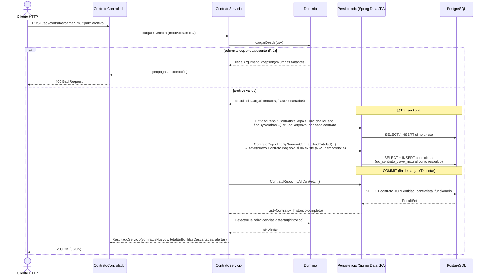
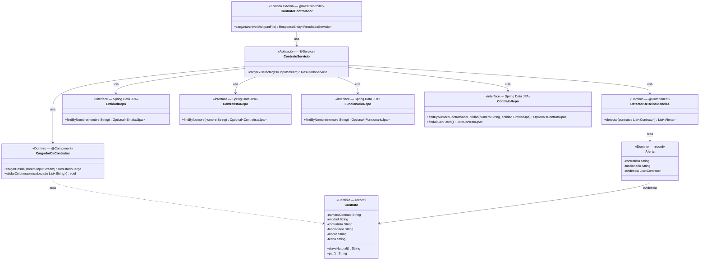

# Esqueleto andante — Rebanada

Tecnologías: Java · PostgreSQL

---

## 1 · Selección de rebanada

### Candidatas

**Candidata A — Carga y persistencia sin detección**

`CSV → CargadorDeContratos (Java) → JDBC → PostgreSQL (INSERT + SELECT) → consola`

Fronteras cruzadas: Entrada externa · Aplicación · Dominio · Persistencia real · Migración — **5 fronteras, 1 regla de negocio (R-2)**.

**Candidata B — Flujo completo: carga + detección + persistencia de alertas**

`CSV → CargadorDeContratos → DetectorDeReincidencias → JDBC → PostgreSQL (5 tablas) → consola`

Fronteras cruzadas: Entrada externa · Aplicación · Dominio · Persistencia real · Migración — **5 fronteras, 4 reglas de negocio (R-2, R-3, R-4, R-6)**.

### Elección: Candidata A

La Candidata B se descarta porque agrega tres reglas de negocio adicionales (R-3, R-4, R-6) sin cruzar ninguna frontera técnica extra: el número de capas es idéntico al de A. El dominio más ancho —cuatro clases en lugar de dos— puede bloquear la validación de la persistencia si falla la detección, que es exactamente lo que el esqueleto debe evitar.

> **Nota (post-implementación, migración a Spring Boot):** la Candidata A elegida aquí excluía la detección a propósito. La implementación real que terminó construyéndose (`java/src/main/java/dac/`, HU-07) incluye `DetectorDeReincidencias` dentro del mismo `ContratoServicio.cargarYDetectar`, es decir, se acerca más a la Candidata B en alcance funcional — aunque conserva las mismas 5 fronteras técnicas. Ver sección 6 para el detalle de esta divergencia.

### Fronteras que cruza la Candidata A

| # | Frontera | Qué ocurre |
|---|---|---|
| 1 | Entrada externa | Cliente HTTP invoca `POST /api/contratos/cargar`, recibido por `ContratoControlador` |
| 2 | Aplicación | `ContratoServicio` orquesta la rebanada |
| 3 | Dominio | `CargadorDeContratos` construye objetos `Contrato` con clave natural |
| 4 | Persistencia real | JDBC escribe y lee en PostgreSQL (mapeo dominio ↔ SQL) |
| 5 | Migración | `db/schema.sql` debe estar aplicado para que existan las tablas |

---

## 2 · Diagrama de secuencia

> Actualizado a la implementación real en Spring Boot (`java/src/main/java/dac/`). El punto de entrada dejó de ser un CLI (`dac.Main`, que nunca llegó a existir — ver sección 6) y pasó a ser el endpoint HTTP `POST /api/contratos/cargar`. `ContratoControlador` y `ContratoServicio` se modelan como participantes separados a propósito: son dos fronteras técnicas distintas de la Tarea 2 (1 — Entrada externa, 2 — Aplicación), no una sola clase con dos nombres.

---

## 3 · Diagrama de clases

Solo las clases que aparecen como participantes o mensajes en la sección 2 — mismo criterio del documento original. Actualizado a los nombres reales de `java/src/main/java/dac/`. `ContratoRepositorio` / `ContratoRepositorioJDBC` no existen en esta implementación: Spring Data JPA genera la implementación de cada repositorio a partir de la interfaz, así que no hay una clase de implementación manual que modelar. `ContratoControlador`, `DetectorDeReincidencias` y `Alerta` sí aparecen ahora como participantes de la sección 2 (a diferencia del diseño original de la Candidata A), así que se incluyen aquí.

> Nota: a diferencia del módulo Java plano (`java/src/dac/`), aquí `clavesVistas` **no es un campo de instancia** de `CargadorDeContratos` — es una variable local dentro de `procesar(...)`, así que solo deduplica filas dentro de un mismo archivo CSV. La idempotencia entre ejecuciones/archivos la garantiza la base de datos (`ContratoRepo.findByNumeroContratoAndEntidad` + `uq_contrato_clave_natural`), no la memoria del objeto.

---

## 4 · Contrato de la prueba única

**Nombre:** `e2e_carga_persiste_y_es_idempotente`

**Punto de entrada:** llamada directa a `ContratoServicio.cargarYDetectar(InputStream csv)` con el contenedor `dac_db` corriendo (`docker compose up -d db`) y `java/src/main/resources/application.properties` apuntando a él. Es el mismo método que invoca `POST /api/contratos/cargar`; la prueba lo llama directamente en vez de levantar el servidor HTTP completo, porque no existe (ni existió nunca) un `Main` que reciba la ruta del CSV como argumento — ver sección 6.

**Precondición de datos:** tablas `entidad`, `contratista`, `funcionario` y `contrato` vacías. `docker-compose.yml` siembra datos de ejemplo al iniciar el contenedor (`db/datos.sql`), así que la prueba las trunca explícitamente antes de cada corrida (`TRUNCATE ... RESTART IDENTITY CASCADE`) — no es lógica de negocio, es preparación de la prueba. El CSV de ejemplo (`data/contratos_ejemplo.csv`) contiene 5 filas con claves naturales distintas y todas las columnas requeridas presentes.

**Acción — primera ejecución:** llamar `cargarYDetectar` con el CSV de ejemplo.

**Aserción observable:**
1. `ResultadoServicio.contratosNuevos() == 5` y `totalEnBd() == 5`.
2. `ContratoRepo.count() == 5`.
3. `EntidadRepo.count() == 2`.

**Acción — segunda ejecución (idempotencia HU-07):** volver a llamar `cargarYDetectar` con el mismo CSV, BD intacta.

**Aserción observable:**
1. `ResultadoServicio.contratosNuevos() == 0` y `totalEnBd() == 5`.
2. `ContratoRepo.count()` sigue devolviendo `5`.

**Estado esperado en BD:** 5 filas en `contrato`, cada una con FK válida a `entidad`, `contratista` y `funcionario`. Cero filas duplicadas.

**Verificación por frontera:**

| Frontera | La prueba la detecta si se rompe |
|---|---|
| Entrada externa (HTTP/servicio) | `cargarYDetectar` no recibe el stream → excepción antes de tocar Dominio |
| Aplicación | `ContratoServicio` no invoca los repos → `ContratoRepo.count()` queda en 0, aserción 2 falla |
| Dominio | `validarColumnas` falla → `IllegalArgumentException`, COUNT en BD = 0 |
| Mapeo dominio→JPA | `save` mal formado → error de Hibernate/constraint o COUNT ≠ 5 |
| Driver JDBC / Hikari | Conexión rechazada → error visible, aserción 2 falla |
| Migración | Tabla inexistente → `relation does not exist`, aserción 2 falla |
| Base de datos | PostgreSQL apagado → connection refused, aserción 2 falla |
| Respuesta | `ResultadoServicio` con campos en 0 o incorrectos → aserción 1 falla |

**Frontera con riesgo residual:** si `findAllConFetch()` devuelve filas en orden distinto o con valores corruptos pero el COUNT es correcto, la aserción de cantidad pasa. Se mitiga añadiendo una aserción sobre el `numeroContrato` de al menos una fila específica del CSV (pendiente, no implementada aún en `ContratoServicioE2ETest`).

---

## 5 · Trazabilidad

Toda fila apunta a contenido existente y verificable en el repositorio.

| Elemento del diagrama | Archivo de origen | Línea / sección |
|---|---|---|
| `ContratoControlador` | `java/src/main/java/dac/api/ContratoControlador.java` | `class ContratoControlador` |
| `cargar(MultipartFile archivo)` / `POST /api/contratos/cargar` | `java/src/main/java/dac/api/ContratoControlador.java` | operación de `ContratoControlador` |
| `ContratoServicio` | `java/src/main/java/dac/aplicacion/ContratoServicio.java` | `class ContratoServicio` |
| `cargarYDetectar(InputStream csv)` | `java/src/main/java/dac/aplicacion/ContratoServicio.java` | operación de `ContratoServicio` |
| `CargadorDeContratos` | `java/src/main/java/dac/dominio/CargadorDeContratos.java` | `class CargadorDeContratos` |
| `cargarDesde(InputStream stream)` | `java/src/main/java/dac/dominio/CargadorDeContratos.java` | operación de `CargadorDeContratos` |
| `validarColumnas()` | `java/src/main/java/dac/dominio/CargadorDeContratos.java` | método privado |
| `Contrato` | `java/src/main/java/dac/dominio/Contrato.java` | `record Contrato` |
| `claveNatural()` / `par()` | `java/src/main/java/dac/dominio/Contrato.java` | operaciones de `Contrato` |
| `DetectorDeReincidencias` | `java/src/main/java/dac/dominio/DetectorDeReincidencias.java` | `class DetectorDeReincidencias` |
| `Alerta` | `java/src/main/java/dac/dominio/Alerta.java` | `record Alerta` |
| `EntidadRepo`, `ContratistaRepo`, `FuncionarioRepo`, `ContratoRepo` | `java/src/main/java/dac/persistencia/*Repo.java` | interfaces `JpaRepository` |
| `ContratoRepo.findByNumeroContratoAndEntidad` (idempotencia, R-2) | `java/src/main/java/dac/persistencia/ContratoRepo.java` | método de la interfaz |
| `uq_contrato_clave_natural` (respaldo de idempotencia en BD) | `db/schema.sql` | `CONSTRAINT uq_contrato_clave_natural` |
| `tabla entidad` / `contratista` / `funcionario` / `contrato` | `db/schema.sql` | `CREATE TABLE ...` |
| R-1 (6 columnas requeridas) | `docs/reglas-de-negocio.md` | R-1 |
| R-2 (clave natural = numero_contrato + entidad) | `docs/problema-duro.md` | §3 — Decisión: la clave natural |
| Idempotencia entre ejecuciones | `docs/historias-usuario.md` | HU-07, criterios 1 y 2 |
| JOIN entidad/contratista/funcionario en SELECT | `docs/esquema-bd.md` | Modelo lógico — relaciones CONTRATO → ENTIDAD, CONTRATISTA, FUNCIONARIO |
| **Prueba única implementada** | `java/src/test/java/dac/ContratoServicioE2ETest.java` | `e2e_carga_persiste_y_es_idempotente` |

---

## 6 · VACÍOS DETECTADOS

| Elemento necesario para la rebanada | Archivo donde debería estar | Estado |
|---|---|---|
| ~~`Main` (clase de la capa Aplicación) no aparece en ningún insumo de modelado~~ | — | **Ya no aplica.** El punto de entrada real de la implementación es HTTP (`POST /api/contratos/cargar` vía `ContratoControlador` → `ContratoServicio`), no un CLI. No se construyó ni se planea construir un `Main` que reciba la ruta del CSV como argumento. |
| ~~`ContratoRepositorio` / `ContratoRepositorioJDBC` no existen~~ | — | **Ya no aplica tal como estaba redactado.** No hay un puerto manual ni una implementación JDBC hecha a mano: Spring Data JPA genera la implementación de `EntidadRepo`, `ContratistaRepo`, `FuncionarioRepo` y `ContratoRepo` a partir de las interfaces. Es una decisión de arquitectura distinta a la del diagrama original, no un vacío pendiente. |
| **Punto de entrada cambió de CLI a HTTP respecto al diseño original de esta rebanada** | `esqueleto/rebanada.md` (este documento, secciones 2 y 4) | **Nuevo.** La sección 4 original asumía `java -cp java/build dac.Main data/contratos_ejemplo.csv`. La versión que efectivamente persiste en PostgreSQL real es la de Spring Boot (`java/src/main/java/dac/`), que solo expone un endpoint HTTP — el módulo plano (`java/src/dac/`) nunca llegó a conectar con la base de datos (ver comparación previa). Se optó por documentar y probar la versión que sí cumple el objetivo central de la rebanada (cruzar la frontera de persistencia real) en vez de terminar el CLI original, que habría duplicado el trabajo de conexión JDBC ya resuelto por Spring Data. |
| **La rebanada real incluye detección (`DetectorDeReincidencias`), no solo carga + persistencia** | `esqueleto/rebanada.md` §1 (Candidata A) | **Nuevo.** La Candidata A se eligió explícitamente *sin* detección para no bloquear la validación de persistencia. `ContratoServicio.cargarYDetectar` terminó incluyéndola de todas formas, dentro de la misma transacción. Funcionalmente el resultado se parece más a la Candidata B en alcance (aunque sin persistir la alerta ni su evidencia en las tablas `alerta`/`alerta_contrato` — eso sigue pendiente). No se revirtió esta decisión porque ya está implementada y probada; se deja registrada como divergencia respecto al análisis original. |
| Persistencia de alertas (`alerta`, `alerta_contrato`) | `java/src/main/java/dac/aplicacion/ContratoServicio.java` | **Sigue pendiente.** `ContratoServicio` detecta y devuelve las alertas en la respuesta HTTP, pero no las inserta en `alerta`/`alerta_contrato`. El esquema (`db/schema.sql`) ya las modela; falta el código que las guarde. |
| Pruebas propias del módulo Spring Boot más allá de la prueba única | `java/src/test/java/dac/` | **Pendiente.** Solo existe `ContratoServicioE2ETest` (esta prueba). No hay pruebas unitarias de `CargadorDeContratos`, `DetectorDeReincidencias` ni de los repositorios en este árbol — las 26 pruebas equivalentes viven únicamente en el módulo plano (`java/test/dac/pruebas/`), que ya no se ejecuta desde `java/ejecutar.sh` (ver comparación previa entre ambos módulos). |
| Los archivos de insumos fueron entregados con nombres distintos a los del repositorio: `backlog.md` → `historias-usuario.md`; `domain-model.md` → `diagrama-dominio.md`; `data-model.md` → `esquema-bd.md` | Los archivos del repositorio deberían renombrarse o la tarea debe actualizar los nombres de referencia | Sin cambios — no relacionado con la migración a Spring Boot. |
