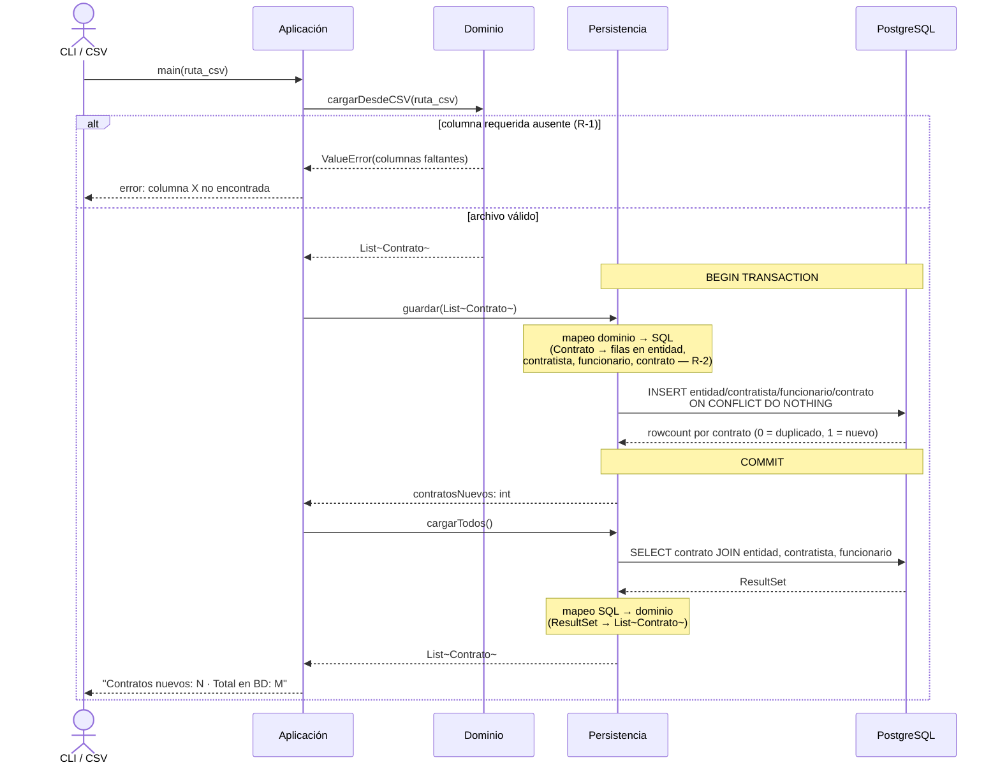
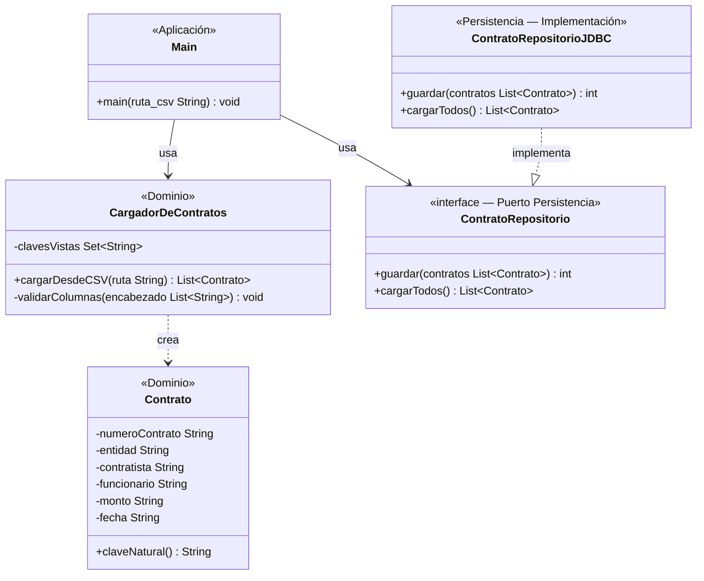

# Esqueleto andante — Rebanada

Tecnologías: Java · PostgreSQL

---

## 1 · Selección de rebanada

### Candidatas

**Candidata A — Carga y persistencia sin detección**

`CSV → CargadorDeContratos (Java) → JDBC → PostgreSQL (INSERT + SELECT) → consola`

Fronteras cruzadas: Entrada externa · Aplicación · Dominio · Persistencia real · Migración — **5 fronteras, 1 regla de negocio (R-2)**.

**Candidata B — Flujo completo: carga + detección + persistencia de alertas**

`CSV → CargadorDeContratos → DetectorDeReincidencias → JDBC → PostgreSQL (5 tablas) → consola`

Fronteras cruzadas: Entrada externa · Aplicación · Dominio · Persistencia real · Migración — **5 fronteras, 4 reglas de negocio (R-2, R-3, R-4, R-6)**.

### Elección: Candidata A

La Candidata B se descarta porque agrega tres reglas de negocio adicionales (R-3, R-4, R-6) sin cruzar ninguna frontera técnica extra: el número de capas es idéntico al de A. El dominio más ancho —cuatro clases en lugar de dos— puede bloquear la validación de la persistencia si falla la detección, que es exactamente lo que el esqueleto debe evitar.

### Fronteras que cruza la Candidata A

| # | Frontera | Qué ocurre |
|---|---|---|
| 1 | Entrada externa | CLI invoca `Main` con la ruta del CSV |
| 2 | Aplicación | `Main` orquesta la rebanada |
| 3 | Dominio | `CargadorDeContratos` construye objetos `Contrato` con clave natural |
| 4 | Persistencia real | JDBC escribe y lee en PostgreSQL (mapeo dominio ↔ SQL) |
| 5 | Migración | `db/schema.sql` debe estar aplicado para que existan las tablas |

---

## 2 · Diagrama de secuencia

---

## 3 · Diagrama de clases

Solo las clases que aparecen como participantes o mensajes en la sección 2.
`ContratoRepositorio` y su implementación no existen en los insumos — ver sección 6.

> `DetectorDeReincidencias` y `Alerta` están en `diagrama-dominio.md` pero no aparecen en la sección 2 → excluidas.

---

## 4 · Contrato de la prueba única

**Nombre:** `e2e_carga_persiste_y_es_idempotente`

**Punto de entrada:** CLI ejecuta `java -cp java/build dac.Main data/contratos_ejemplo.csv` con el contenedor `dac_db` corriendo y las variables de entorno de conexión configuradas.

> ⚠ Este punto de entrada asume que `Main.java` ya llama a `ContratoRepositorio`. Mientras esa integración no exista, el punto de entrada es un VACÍO — ver sección 6.

**Precondición de datos:** tablas `entidad`, `contratista`, `funcionario` y `contrato` vacías. El CSV de ejemplo contiene 5 filas con claves naturales distintas y todas las columnas requeridas presentes.

**Acción — primera ejecución:** correr el comando. Capturar stdout y ejecutar `SELECT COUNT(*) FROM contrato` en PostgreSQL.

**Aserción observable:**
1. Stdout contiene `"Contratos nuevos: 5"` y `"Total en BD: 5"`.
2. `SELECT COUNT(*) FROM contrato` devuelve `5`.
3. `SELECT COUNT(*) FROM entidad` devuelve `2`.

**Acción — segunda ejecución (idempotencia HU-07):** mismo comando, BD intacta.

**Aserción observable:**
1. Stdout contiene `"Contratos nuevos: 0"` y `"Total en BD: 5"`.
2. `SELECT COUNT(*) FROM contrato` sigue devolviendo `5`.

**Estado esperado en BD:** 5 filas en `contrato`, cada una con FK válida a `entidad`, `contratista` y `funcionario`. Cero filas duplicadas.

**Verificación por frontera:**

| Frontera | La prueba la detecta si se rompe |
|---|---|
| Entrada externa | CSV inexistente → excepción en Dominio, stdout sin "Contratos nuevos" |
| Aplicación | Main no invoca Dominio → stdout vacío, aserción 1 falla |
| Dominio | validarColumnas falla → error visible, COUNT en BD = 0 |
| Mapeo dominio→SQL | INSERT mal formado → SQL error o COUNT ≠ 5 |
| Driver JDBC | Conexión rechazada → error visible, aserción 2 falla |
| Migración | Tabla inexistente → `relation does not exist`, aserción 2 falla |
| Base de datos | PostgreSQL apagado → connection refused, aserción 2 falla |
| Respuesta | Stdout no contiene la cadena esperada → aserción 1 falla |

**Frontera con riesgo residual:** si `cargarTodos()` devuelve filas en orden distinto o con valores corruptos pero el COUNT es correcto, la aserción de cantidad pasa. Se mitiga añadiendo una aserción sobre el `numero_contrato` de al menos una fila específica del CSV.

---

## 5 · Trazabilidad

Toda fila apunta a contenido existente y verificable en el repositorio.

| Elemento del diagrama | Archivo de origen | Línea / sección |
|---|---|---|
| `CargadorDeContratos` | `docs/diagrama-dominio.md` | `class CargadorDeContratos` |
| `cargarDesdeCSV(ruta String)` | `docs/diagrama-dominio.md` | operación de `CargadorDeContratos` |
| `validarColumnas()` | `docs/diagrama-dominio.md` | operación privada de `CargadorDeContratos` |
| `clavesVistas: Set~String~` | `docs/diagrama-dominio.md` | atributo de `CargadorDeContratos` |
| `Contrato` | `docs/diagrama-dominio.md` | `class Contrato` |
| `claveNatural()` | `docs/diagrama-dominio.md` | operación de `Contrato` |
| Error por columna ausente | `docs/historias-usuario.md` | HU-01, criterio 2 |
| R-1 (6 columnas requeridas) | `docs/reglas-de-negocio.md` | R-1 |
| R-2 (clave natural = numero_contrato + entidad) | `docs/problema-duro.md` | §3 — Decisión: la clave natural |
| `ON CONFLICT DO NOTHING` (idempotencia en BD) | `db/schema.sql` | `CONSTRAINT uq_contrato_clave_natural` |
| `tabla entidad` | `db/schema.sql` | `CREATE TABLE entidad` |
| `tabla contratista` | `db/schema.sql` | `CREATE TABLE contratista` |
| `tabla funcionario` | `db/schema.sql` | `CREATE TABLE funcionario` |
| `tabla contrato` | `db/schema.sql` | `CREATE TABLE contrato` |
| `BEGIN TRANSACTION / COMMIT` | `db/schema.sql` | líneas 12 y 152 |
| Idempotencia entre ejecuciones | `docs/historias-usuario.md` | HU-07, criterios 1 y 2 |
| JOIN entidad/contratista/funcionario en SELECT | `docs/esquema-bd.md` | Modelo lógico — relaciones CONTRATO → ENTIDAD, CONTRATISTA, FUNCIONARIO |

---

## 6 · VACÍOS DETECTADOS

| Elemento necesario para la rebanada | Archivo donde debería estar |
|---|---|
| `Main` (clase de la capa Aplicación) no aparece en ningún insumo de modelado | `domain-model.md` / `docs/diagrama-dominio.md` |
| `ContratoRepositorio` (interfaz/puerto entre Dominio y Persistencia) no existe en ningún insumo | `domain-model.md` — debe modelarse el puerto de persistencia |
| `ContratoRepositorioJDBC` (implementación JDBC de la interfaz anterior) no existe en ningún insumo | `domain-model.md` o documento de arquitectura separado |
| Integración Java ↔ PostgreSQL no implementada: `Main.java` no llama a ningún repositorio, por lo que el punto de entrada de la prueba (sección 4) no puede ejecutarse aún | `java/src/dac/Main.java` — debe añadirse la llamada al repositorio |
| Variables de entorno o configuración de conexión JDBC no definidas en ningún insumo | Documento de decisiones técnicas (`docs/decisiones-tecnicas.md`) o archivo de configuración |
| Los archivos de insumos fueron entregados con nombres distintos a los del repositorio: `backlog.md` → `historias-usuario.md`; `domain-model.md` → `diagrama-dominio.md`; `data-model.md` → `esquema-bd.md` | Los archivos del repositorio deberían renombrarse o la tarea debe actualizar los nombres de referencia |
